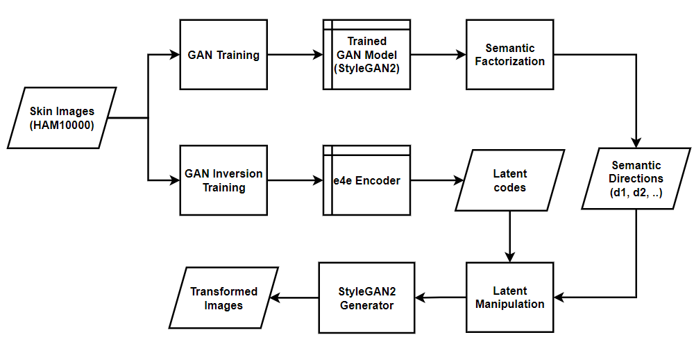
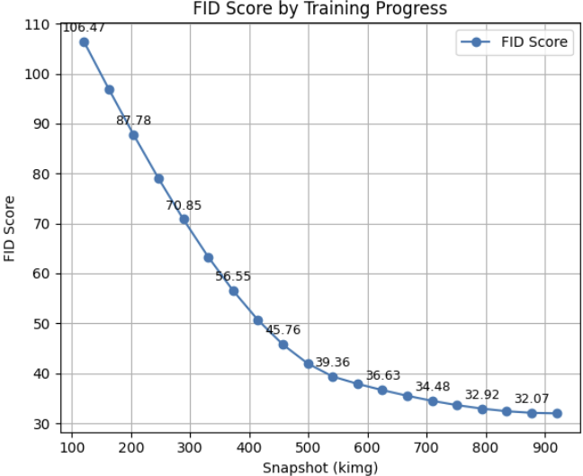

# 피부암 병변 진행 시뮬레이션 (StyleGAN2 · e4e · SeFa)

본 저장소는 공개 피부 병변 데이터셋 **HAM10000**을 사용해 **StyleGAN2-ADA**를 학습하고, **custom e4e 인코더**로 실제 이미지를 **W+ latent space**에 투영한 뒤, **SeFa(Closed-form Semantic Factorization)** 로 추출한 의미 방향을 따라 latent를 조작해 **병변 진행(nevus → melanoma) 시각화를 시뮬레이션**한 연구 구현물입니다.  

---

## 1. 연구 동기 (Motivation)
- 피부암(특히 **melanoma**)은 전이 속도가 빠르고 치사율이 높습니다.  
- 정량적 **진행 추정/시뮬레이션**이 가능하다면 조기 판단과 교육, 데이터 증강에 유용합니다.  
- GAN은 제한적 의료 데이터에서도 **고해상도 합성**에 강점을 보여 왔습니다.  
- 본 연구는 **단일 이미지로부터 병변 진행을 시각적으로 추정·생성**할 수 있는 가능성을 탐구했습니다.  

---

## 2. 전체 파이프라인
  
*그림 1. Skin images → StyleGAN2 학습 → e4e 인버전 → SeFa 의미 방향 → Latent 조작 → 진행 시뮬레이션 생성*

---

## 3. 데이터셋과 전처리
- **데이터:** HAM10000, 총 10,015장 중 **nv 6,705 / mel 1,113 (약 7,800장)** 사용  
- **전처리:** 원본 600×450 → 중심 crop + padding → **512×512** 리사이즈  
- 목적: **정상/초기 병변 → 악성 진행** 과정을 명확히 구분  

  
*그림 2. HAM10000 실제 샘플(발색, 경계, 질감 다양성)*

---

## 4. 방법 (Methods)

### 4.1 StyleGAN2-ADA 학습
- 단일 latent 공간에 nv/mel 병변을 모두 포괄  
- 학습량: **920kimg**, GPU: **NVIDIA L4**, 약 **2일**  
- 평가: **FID** (106.47 → **31.96**)  

  
*그림 3. 학습 진행에 따른 FID 감소 추이*

  
*그림 4. 920kimg 시점 StyleGAN2 생성 결과*

---

### 4.2 Inversion: custom e4e 인코더
- **ResNet-IR 기반** 인코더, StyleGAN2 generator 고정 후 fine-tuning  
- 이미지를 **W+ latent**로 투영  
- 최종 L2 reconstruction loss = **0.0039**  

  
*그림 5. Input–Target–Output 비교: 형태·경계·색조 재현*

---

### 4.3 의미 방향 추출: SeFa
- Style space 고유벡터 분해 → 주요 축(d1, d2…) 추출  
- scaling factor α ↑ → **색소 증가, 경계 퍼짐, 병변 확장** 관찰  

  
  
*그림 6–7. SeFa 방향에 따른 시각적 변화(α 증가)*

---

### 4.4 진행 시뮬레이션
- 임상적으로 의미 있는 SeFa 축 선택  
- latent vector를 점진적으로 이동 (α 조절)  
- **LPIPS** 지표로 정량 평가 (α ↑ 시 차이 증가)  

  
  
*그림 8–9. 진행 시뮬레이션(위: 실제 장기 변화, 아래: latent 조작)*

---

## 5. 실험 환경 (Environment)

### 5.1 논문 실험
- GPU: **NVIDIA L4**  
- 학습량: 920kimg (약 2일)  
- 입력 해상도: 512×512  
- FID 최종 31.96, e4e L2 = 0.0039, LPIPS는 α에 따라 증가  

### 5.2 재현용 예시
- OS: Ubuntu 20.04/22.04 (또는 WSL2)  
- Python 3.9  
- PyTorch 1.13.1 + CUDA 11.7, torchvision 0.14.1  
- numpy 1.24.4, pillow, scikit-image, tqdm  

```bash
# 가상환경
conda create -n skin-gan python=3.9 -y
conda activate skin-gan

# 필수 패키지
pip install torch==1.13.1 torchvision==0.14.1 --extra-index-url https://download.pytorch.org/whl/cu117
pip install numpy==1.24.4 pillow scikit-image tqdm matplotlib
